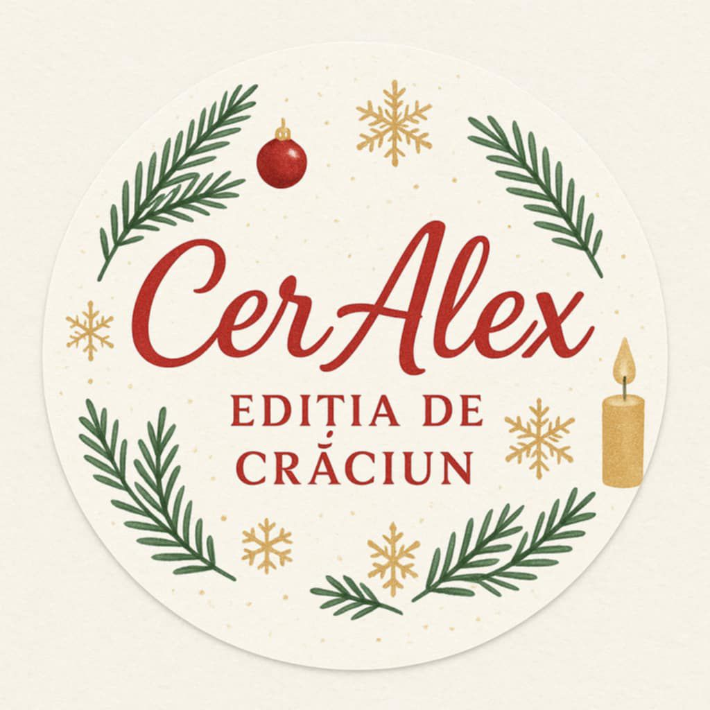
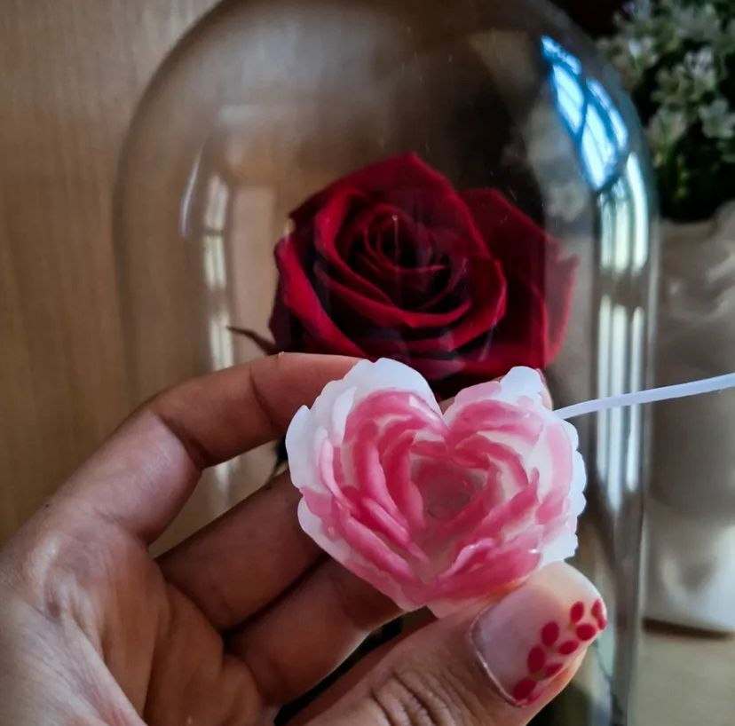
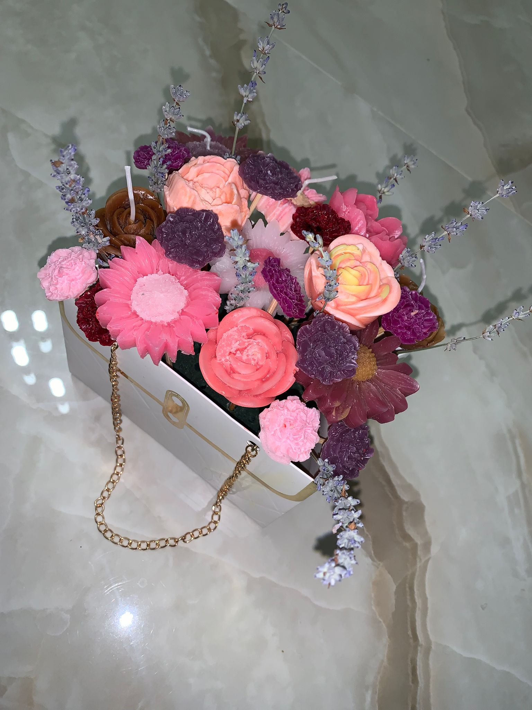
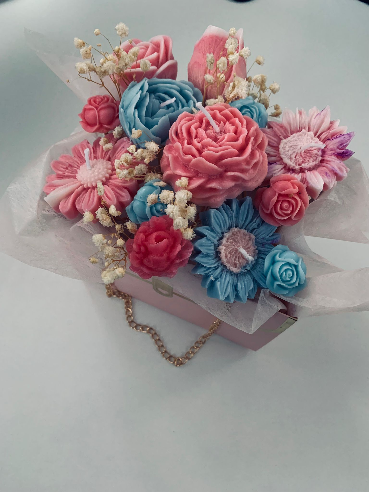
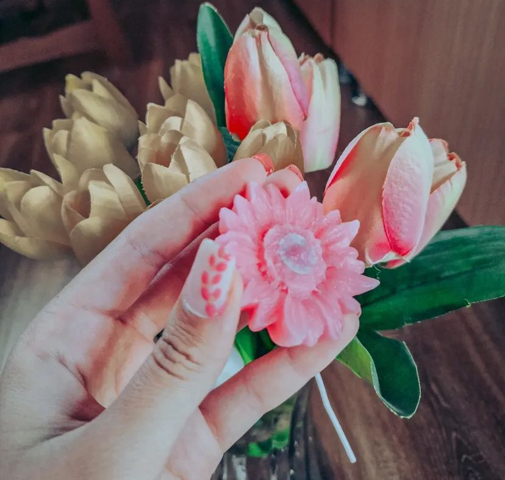
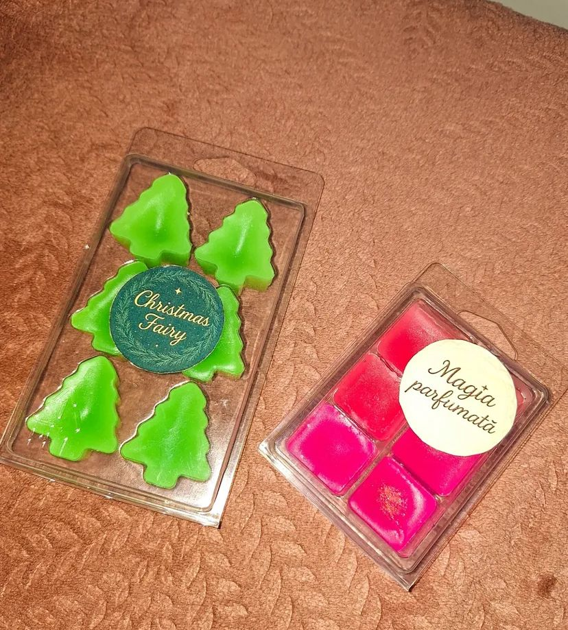
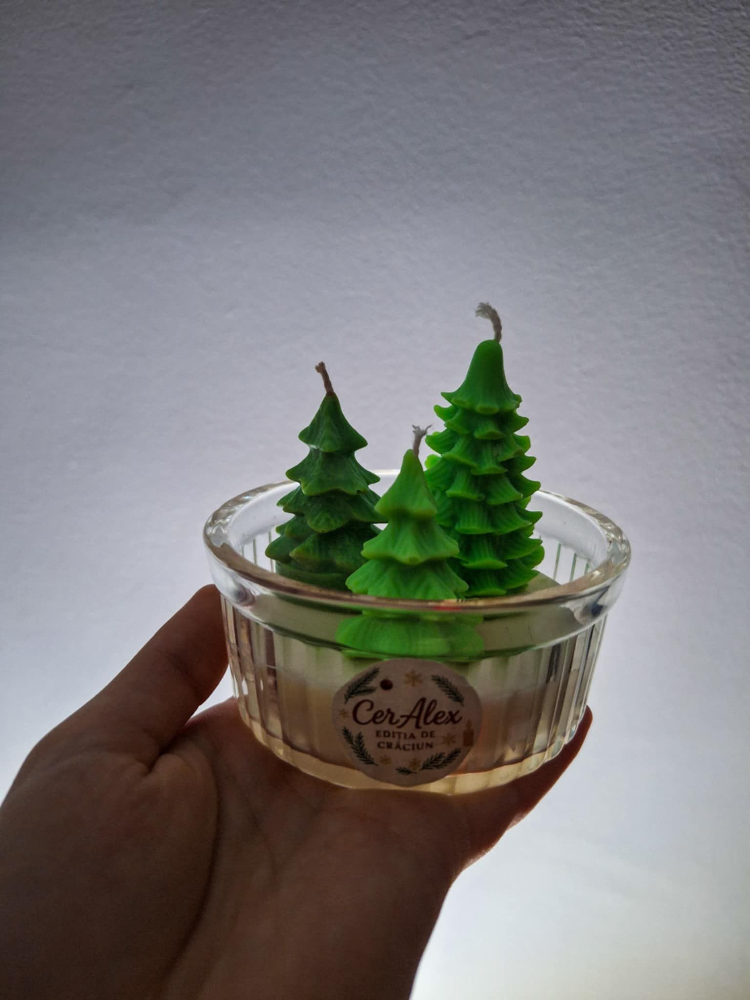

<!DOCTYPE html>
<html lang="ro">
<head>
  <meta charset="UTF-8" />
  <meta name="viewport" content="width=device-width, initial-scale=1" />
  <title>CerAlex – Lumânări parfumate & produse din ceară</title>
  <meta name="description" content="CerAlex – lumânări parfumate, aranjamente florale din ceară și blocuri de ceară parfumată, realizate manual cu suflet și culoare." />
  
</head>
<body>
  <!-- Header centrat cu logo -->
  <header>
    

      

        <!-- Încarcă emblema brandului ca Emblema.jpg sau schimbă numele fișierului -->
        
      

      
CerAlex

      <nav class="nav">
        <a href="#acasa">Acasă</a>
        <a href="#florale">Aranjamente florale</a>
        <a href="#blocuri">Blocuri de ceară</a>
        <a href="#iarna">Sărbătorile de iarnă</a>
        <a href="#despre">Despre CerAlex</a>
        <a href="#contact">Contact</a>
        <a href="#livrari">Livrări</a>
      </nav>
    

  </header>

  

    <!-- Poveste de început -->
    <section class="hero" id="acasa">
      

      Magia CerAlex
      

        Lumânări parfumate și aranjamente din ceară, turnate manual, cu culori vii și arome alese. Fiecare piesă spune o poveste caldă.
      

      <!-- Tabs categorii (butonare rapidă) -->
      

        <button class="tab-btn active" data-tab="florale">Aranjamente florale</button>
        <button class="tab-btn" data-tab="blocuri">Blocuri din ceară parfumată</button>
        <button class="tab-btn" data-tab="iarna">Sărbătorile de iarnă</button>
      

    </section>

    <!-- Categorie 1: Aranjamente florale -->
    <section id="florale" class="tab-panel">
      <h2>Aranjamente florale</h2>
      

        <article class="card">
          

            <h3>Floricele simple</h3>
            <button class="fav" aria-label="Favorite">♡</button>
          

          Delicate & parfumate
          
Accente colorate care aduc prospețime în orice colț al casei.

          <!-- Imagine simplă -->
          

            
          

          
Preț: 7 RON

          <button class="cta">Detalii</button>
        </article>

        <article class="card">
          

            <h3>Coșulețe cu floricele</h3>
            <button class="fav" aria-label="Favorite">♡</button>
          

          Cadouri elegante
          
Combinații de culori și arome, atent îmbinate.

          <!-- Două imagini în același chenar -->
          

            
            
          

          
Preț: 70 RON

          <button class="cta">Detalii</button>
        </article>

        <article class="card">
          

            <h3>Floricele parfumate</h3>
            <button class="fav" aria-label="Favorite">♡</button>
          

          Experiență senzorială
          
Frumusețe vizuală cu mirosuri încântătoare.

          <!-- Slider cu 3 imagini -->
          

            

              
              
              
            

            

              
              
              
            

          

          
Preț: 7 RON

          <button class="cta">Detalii</button>
        </article>
      

    </section>

    <!-- Categorie 2: Blocuri din ceară parfumată -->
    <section id="blocuri" class="tab-panel" hidden>
      <h2>Blocuri din ceară parfumată</h2>
      

        <article class="card">
          

            <h3>Forme variate</h3>
            <button class="fav" aria-label="Favorite">♡</button>
          

          Culori tari
          
Blocuri turnate manual în forme jucăușe.

          

            
          

          
Preț: 15 RON

          <button class="cta">Detalii</button>
        </article>

        <article class="card">
          

            <h3>Arome intense</h3>
            <button class="fav" aria-label="Favorite">♡</button>
          

          Relaxare rapidă
          
Se topesc ușor și eliberează parfum plăcut.

          

            
            
          

          
Preț: 20 RON

          <button class="cta">Detalii</button>
        </article>
      

    </section>

    <!-- Categorie 3: Sărbătorile de iarnă -->
    <section id="iarna" class="tab-panel" hidden>
      <h2>Sărbătorile de iarnă</h2>
      

        <article class="card">
          

            <h3>Lumânări de sezon</h3>
            <button class="fav" aria-label="Favorite">♡</button>
          

          Scorțișoară • Vanilie • Brad
          
Inspirate din magia iernii.

          

            
          

          
Preț: 30 RON

          <button class="cta">Detalii</button>
        </article>

        <article class="card">
          

            <h3>Aranjamente de sezon</h3>
            <button class="fav" aria-label="Favorite">♡</button>
          

          Festiv & cald
          
Culori bogate și detalii jucăușe.

          

            

              
              
            

            

              
              
            

          

          
Preț: 25 RON

          <button class="cta">Detalii</button>
        </article>
      

    </section>

    <!-- Despre CerAlex -->
    <h2 id="despre">Despre CerAlex</h2>
    <section class="info">
      

        CerAlex s-a născut din pasiunea pentru culoare și parfum. Îmbin forme îndrăznețe cu arome calde,
        pentru produse care aduc bucurie în casele oamenilor. Fiecare creație este turnată manual, cu grijă pentru detalii.
      

    </section>

    <!-- Contact -->
    <h2 id="contact">Contact</h2>
    <section class="info">
      
Ai întrebări sau vrei o comandă personalizată? Scrie-mi și îți răspund cu drag.

      

        <a href="https://www.facebook.com/people/Ceralex/100069947412328/?mibextid=wwXIfr&rdid=qJ5MxJXuccJH2E9D&share_url=https%3A%2F%2Fwww.facebook.com%2Fshare%2F16MhW5B9Tk%2F%3Fmibextid%3DwwXIfr" aria-label="Facebook">Facebook</a>
        <a href="https://wa.me/40700000000" target="_blank" rel="noopener" aria-label="WhatsApp">WhatsApp</a>
        <a href="tel:+40700000000" aria-label="Telefon">Telefon</a>
        <a href="https://www.instagram.com/cera_lex3/?igsh=MTlwcTJmZnR6bnZmYg%3D%3D#" target="_blank" rel="noopener" aria-label="Instagram">Instagram</a>
      

    </section>

    <!-- Livrări -->
    <footer id="livrari">
      
Livrări efectuate: 0

      
Fiecare pachet este pregătit cu grijă, ca magia lumânărilor să ajungă la tine în siguranță.

      
© CerAlex – Handmade cu pasiune

    </footer>
  

  <!-- Lightbox -->
  

    <button class="close" aria-label="Închide">×</button>
    
  

  
</body>
</html>
